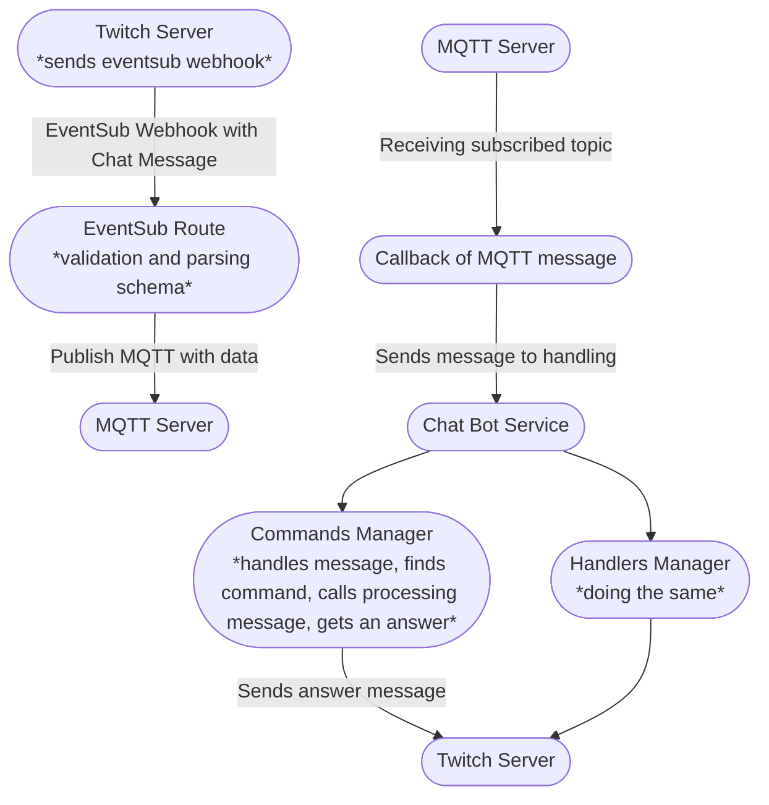

# Message handling

```mermaid
flowchart TD
    Twitch1 --"EventSub Webhook with Chat Message"--> ESRoute --"Publish MQTT with data"--> MQTT1
    Twitch1(["Twitch Server\n*sends eventsub webhook*"])
    ESRoute(["EventSub Route\n*validation and parsing schema*"])
    MQTT1(["MQTT Server"])
    
    MQTT2 --"Receiving subscribed topic"--> MQTTCallback --"Sends message to handling"--> ChatBot --> CommandsManager --"Sends answer message"--> Twitch2
    MQTT2(["MQTT Server"])
    MQTTCallback(["Callback of MQTT message"])
    ChatBot(["Chat Bot Service"])
    CommandsManager(["Commands Manager\n*handles message, finds command, calls processing message, gets an answer*"])
    HandlersManager(["Handlers Manager\n*doing the same*"])
    Twitch2(["Twitch Server"])
    ChatBot --> HandlersManager --> Twitch2
```
